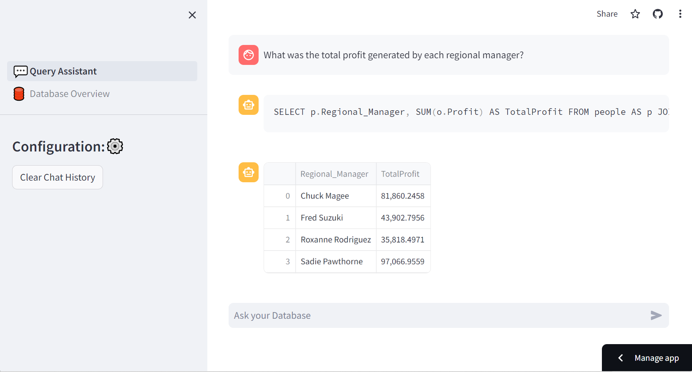
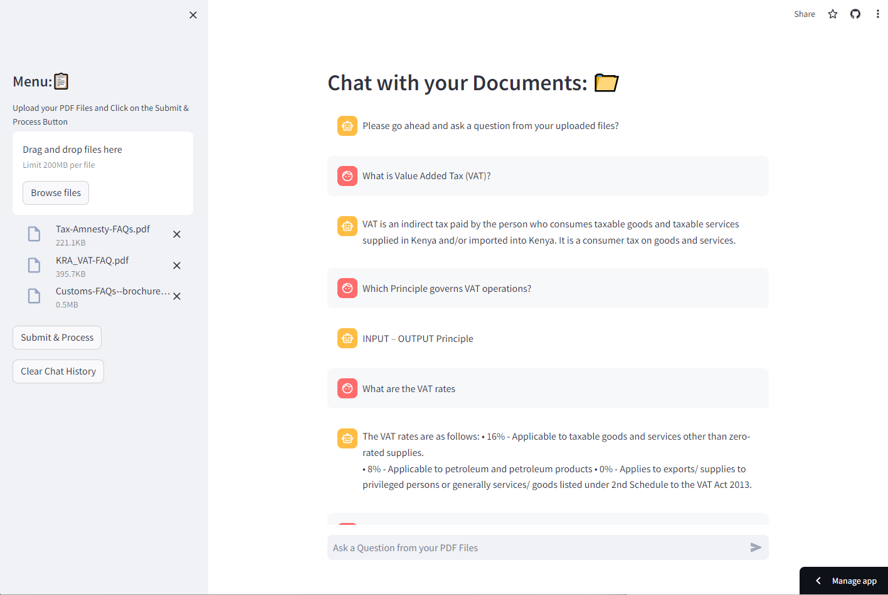
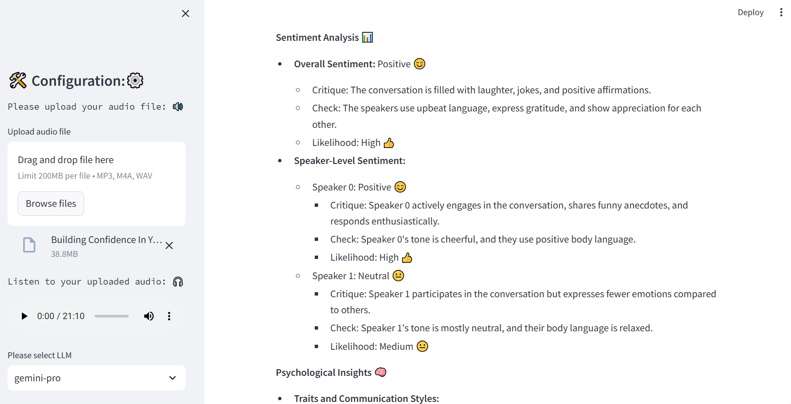

# Chang'ach Dennis
I’m a Data Scientist // Machine Learning Engineer specializing in building innovative data products that create and drive business value. I have worked on products in various domains like e-commerce, logistics, supply chain, fintech, agtech, and SaaS, enabling me to tackle complex challenges across diverse industries.

My expertise includes (not limited to):
- Data Analysis: Python, SQL, Excel/Google Sheets
- Data Visualization: Tableau, Power BI, Looker, Metabase 
- Data Science: Machine Learning, NLP, LLMs, MLOPs
- Product Analytics: Google Analytics, Mixpanel, Amplitude
- ML/AI Frameworks: Scikit-learn, TensorFlow, PyTorch
- Database Management: MySQL, PostgreSQL
- Cloud Platforms: AWS, Google Cloud, Azure

Beyond traditional business sectors, I’m a contributor at Omdena, collaborating with a diverse and talented team of engineers, data scientists, and AI enthusiasts to co-create advanced AI solutions with real-world impact.

## Projects
### Chat With Your Mpesa Statements

Ever wanted to analyze your Mpesa spending using the power of Large Language Models (LLMs) without sharing your sensitive data?

This project encompasses the extraction and cleaning of transactions from Mpesa PDF statements to the development of APIs to utilize LLMs and the building of the Streamlit Front End.

[Github Repo](https://github.com/DennisChangach/Chat-With-Your-Mpesa-Statements)
[Medium Article](https://bit.ly/493WzyP)

### Text to SQL

In today's data-driven world, the ability to extract insights from databases is crucial for decision-making across various domains. However, querying databases often requires proficiency in SQL or a deep understanding of data analysis techniques, posing a significant barrier for non-technical users.

In this project, we'll explore how to bridge this gap by leveraging generative AI to enable users to query databases using simple, conversational language. By enabling natural language queries, users can interact with databases in a more intuitive and user-friendly manner, without the need to learn SQL syntax. This approach democratizes access to data, empowering non-technical users to derive insights and make informed decisions.

[Streamlit App](https://db-query-assistant.streamlit.app/)
[Github Repo](https://github.com/DennisChangach/Text_To_SQL_Superstore_Dataset)
[Medium Article](https://medium.com/@kogeidennis/chat-with-your-database-simplifying-database-queries-a81d80d990e3)

### Chat PDF
This is an end to end LLM project that enables users to interact with the content of their PDF files using Google Gemini Pro and Langchain technologies.

This project provides a streamlined interface for users to ask questions about the content of their PDF files. It leverages Streamlit for the user interface, PyPDF2 for PDF parsing, Google Generative AI Embeddings for text embeddings, Langchain for text splitting and vector storage, and Google Gemini Pro for conversational AI capabilities.

[Github Repo](https://github.com/DennisChangach/Chat_PDF)

### Convo Insights
Convo Insights is a Streamlit-based web application that leverages cutting-edge AI models to uncover insights from audio conversations. With Convo Insights, you can upload audio files and get transcriptions of conversations, along with sentiment analysis, to gain deeper understanding and valuable insights.

[Github Repo](https://github.com/DennisChangach/Convo_Insight)
[Streamlit App](https://convoinsight.streamlit.app/)

